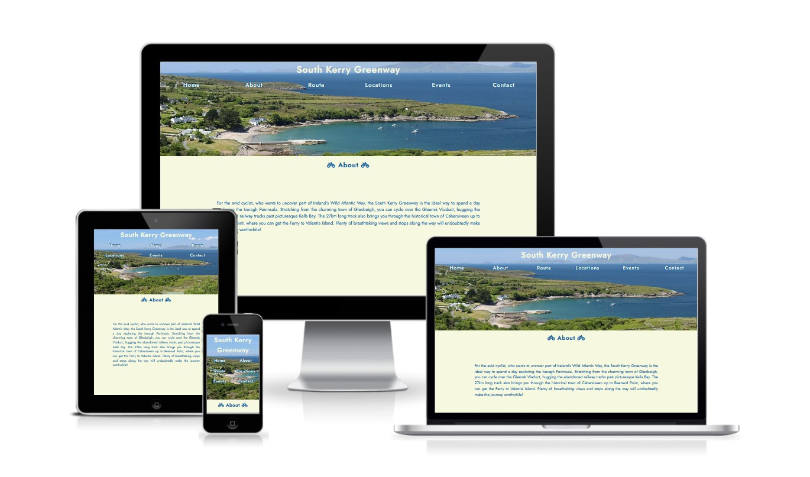
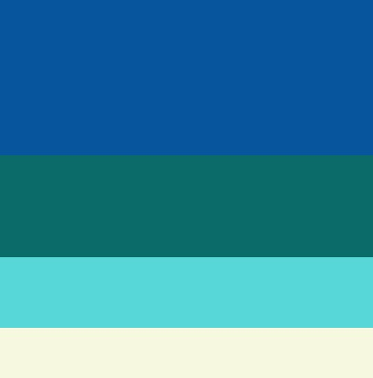
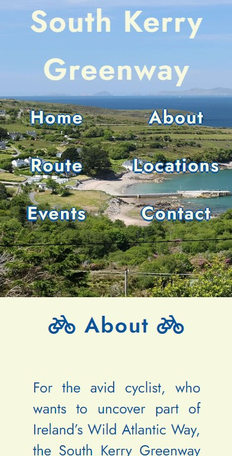
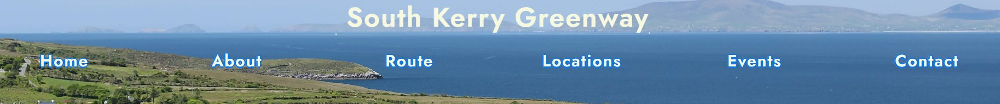
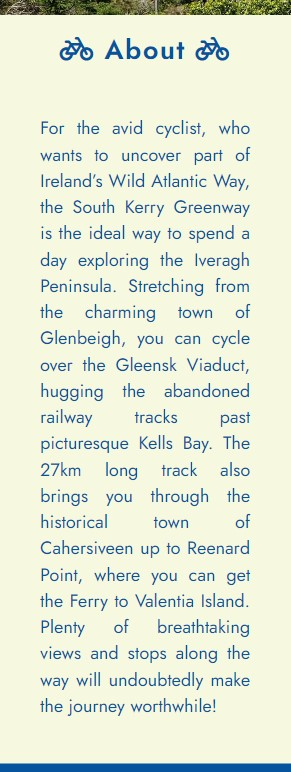
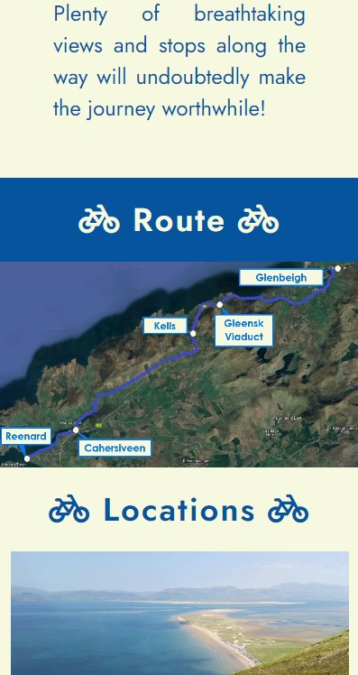
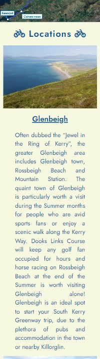

# South Kerry Greenway

# Introduction

## Project Aim
Welcome to a website dedicated to the newly confirmed South Kerry Greenway! It will stretch along the South Kerry Coast for 27km and enable all cyclists to visit 3 key areas on the Iveragh Peninsula – Glenbeigh town, Gleensk Viaduct & Kells Bay, and finally, Cahersiveen town.

The website's primary aim is to provide the user with information about the new cycleway, such as the route, stops and any upcoming events in towns along the route – attracting new tourists to the area. It will also allow any tourists to ask any questions regarding the route via a contact form just above the footer.

# Table of Contents
* [UX](#ux "UX")
    * [User Goals](#user-goals "User Goals")
    * [User Stories](#user-stories "User Stories")
    * [User Requirements and Expectations](#user-requirements-and-expectations)
         * [Requirements](#requirements)
         * [Expectations](#expectations)
    * [Design Choices](#design-choices "Design Choices")
        * [Font](#font "Font")
        * [Icons](#icons "Icons")
        * [Colours](#colours "Colours")
        * [Structure](#structure "Structure")
* [Wireframes](#wireframes "Wireframes")
* [Features](#features "Features")
    * [Existing Features](#existing-features "Existing Features")
        * [Landing Page](#landing-page "Landing Page")
        * [Navigation Bar](#navigation-bar "Navigation Bar")
        * [About](#about "About")
        * [Route](#route "Route")
        * [Locations](#locations "Locations")
        * [Events](#events "Events")
        * [Contact](#contact "Contact")
        * [Footer](#footer "Footer")

# UX
## User Goals
* Easy to navigate around
* Direct Content about the route
* Easily obtainable details of the stops and on the route
* Simple contact instructions
* Aesthetically pleasing website with pictures of and from along the route

## User Stories
* As a user, I want to easily navigate through the website.
* As a user, I want to know where the route is.
* As a user, I want to know where I can stop along the way on the cycle route.
* As a user, I want to know if any events are taking place along the route during the year.
* As a user, I want to be able to easily contact the people who are managing the South Kerry Greenway.
* As a user, I want to check out the social media pages from the South Kerry Greenway.

## User Requirements and Expectations

### Requirements
* Easy to navigate on the different screen sizes – mobile, tablet and larger screens.
* Add all required information in a clear and concise manner.
* Entice the user to cycle the Greenway with attractive pictures and interesting events.
* Provide an quick and simple way to contact the management of the South Kerry Greenway.

### Expectations
* I expect the website to flow nicely with a clear, logical order of sections.
* I expect the website to be completely responsive to all screen sizes
* I expect to set up the form, so that it has to be correctly filled out in order for it to be successfully submitted.
* I expect all links to work correctly.
* I expect all location and social media links to open in a separate tab.

\
&nbsp;
[Back to Top](#table-of-contents)
\
&nbsp;

## Design Choices

### Font
To deviate from the standard fonts, [Google Fonts](https://fonts.google.com/ "Google Fonts") was used to obtain a font style, which would attract people to the website. [Jost]( https://fonts.google.com/specimen/Jost?query=jost) fulfilled the criteria for both headings and main body text, as it was easily readable, had clean edges and complemented the informative nature of the website.

### Icons
In order to obtain some icons for the website, [Font Awesome](https://fontawesome.com/ "Font Awesome") will be utilised. 
Icons are used for decorative purposes, to reinforce the website is dedicated to a cycleway and to describe the events with one symbol. Social media icons will also be used and all icons will be styled to suit the section they are in.

### Colours
To select the colour palette for the project, I used [Color Hunt]( https://colorhunt.co/) to find one that suited the calming coastal vibes of the page and decided to used [this]( https://colorhunt.co/palette/0779e44cbbb977d8d8eff3c6) one. When checking the contrast of the colours on [Web AIM](https://webaim.org/resources/contrastchecker/ "Web AIM"), the deep blue with the light yellow failed. I adjusted the manual colour selector to acquire a darker blue, which met the contrast ratio criteria of 7+. The following colours were selected:

Where:
*  #06549D (also known as --dark blue) is used for the background of alternating blue sections, as well as the header, and blue headings in alternating yellow sections.
*  #0a6a68 (also known as --aquamarine) is used for the background of the events section to add another dark colour to contrast the light yellow.
*  #56d8d8 (also known as --light aqua) is used for the hover effect of the section headings and social media icons in the footer section to provide an alternative contrast to the dark blue sections.
*  #f6f8e0 (also known as --light yellow) is used for the background of alternating yellow sections and yellow headings in alternating blue sections.

### Structure
The website will be built for a small mobile screen of width 320px and then will also meet the requirements for a medium/tablet and large screen, as shown in the table below.

| Screen Size   | Breakpoint |
| -----------   | ---------- |
| small/mobile  |    320px   |
| medium/tablet |    768px   |
| large         |   992+px   |

\
&nbsp;
[Back to Top](#table-of-contents)
\
&nbsp;

# Wireframes
[Balsamic](https://balsamiq.com/wireframes/ "Balsamic") was used to create the conception for the website appearance and flow. I initially created a mobile version in-line with my mobile-first approach and then followed with a medium and large screen version. Mobile-first websites are often scrollable as the UX is poor if new tabs and sites are constantly opening. Therefore, a nav bar and links to each section in the footer aid navigation on the website.

Basic wireframes can be found below:

### [Large Screen Wireframe](documentation/large-screen.png "Large Screen Wireframe ")
### [Medium/Tablet Screen Wireframe]( documentation/medium-screen.png " Medium/Tablet Screen Wireframe ")
### [Mobile Wireframe]( documentation/small-mobile-screen.png "Mobile wireframe")

\
&nbsp;
[Back to Top](#table-of-contents)
\
&nbsp;

# Features
## Existing Features

### Landing Page
The landing page consists of an impressive and enticing image to lure the user in. The ocean view suggests that the area is a tourist attraction and used for either recreation or relaxing activities. The title at the top of the page highlights that the location hero image is part of a cycleway or greenway.

The sizing of the hero image section allows the user to peak into the “About” section, which prompts the user to scroll downwards. This can be seen in the screenshot below:

The larger screen sizes include room for the about section maintain the images aspect ratio so it is not stretched and the navigation bar remains in place.

\
&nbsp;

### Navigation Bar

The navigation bar is designed to be responsive for the different screen sizes and adjusts the width that each section heading item takes up on the screen. Each item within the navigation bar links to a section on the website. In order to increase each items readability, a shadow of contrasting colour is applied around each word, as seen below in a large screen view:

The navigation bar stretches across the screen to fill 100% of the width. No background colour was selected to make the design more seamless and integrated with the website.

To also increase visibility and interactivity with the website, when the titles are hovered over, they automatically underline the heading.

\
&nbsp;

### About
The About section provides a brief, yet informative description about the South Kerry Greenway. It gives the user a succinct synopsis about the stops and tourist attractions along the route, whetting the user’s appetite to read more about the South Kerry Greenway.

It is designed to be responsive with the screen size and therefore, occupies the following space on mobile:

\
&nbsp;

### Route
The Route section provides the user with a labelled aerial map of the South Kerry Greenway. Labels of key stops can be found on the image. This makes it easier for the user to determine information and locations of note on the route.

The image is also designed to be completely responsive for all screen sizes. Mobile screen can be seen below, where the route map fills the entire width of the screen:

For large screens (992+ px), the image keeps its aspect ratio and instead remains at the centre of the screen with a dark blue background. 

\
&nbsp;

### Locations
To provide the user with more information of key stops, the locations section follows the logical progression of thought below the Route section. It provides information on 3 stops – Glenbeigh, Gleensk Viaduct & Kells, as well as Cahersiveen.

On mobile, the places stack on top of one another in the order, as seen below for Glenbeigh:
* Leading Image
* Title
* Descriptive Text

The title also allows the user to click on the town’s specific website, in case they want to look at a certain location in more detail, book accommodation etc.

For large screens (992+ px), the image keeps to the left and both the small heading and the town’s description sit adjacent to it on the right hand side of the screen – reinforcing the flexibility of the website’s design.

\
&nbsp;

