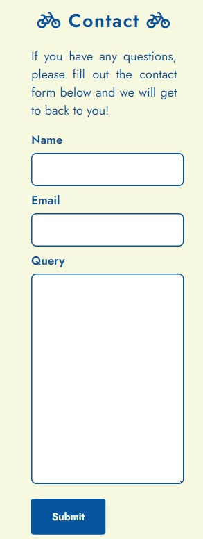

# South Kerry Greenway

# Introduction

## Project Aim
Welcome to a website dedicated to the newly confirmed South Kerry Greenway! It will stretch along the South Kerry Coast for 27km and enable all cyclists to visit 3 key areas on the Iveragh Peninsula – Glenbeigh town, Gleensk Viaduct & Kells Bay, and finally, Cahersiveen town.

The website's primary aim is to provide the user with information about the new cycleway, such as the route, stops and any upcoming events in towns along the route – attracting new tourists to the area. It will also allow any tourists to ask any questions regarding the route via a contact form just above the footer.

[Visit the Website Here](https://grawnya.github.io/south-kerry-greenway/)

[Visit the Project's GitHub Repository Here](https://github.com/Grawnya/south-kerry-greenway)

# Table of Contents

* [UX](#ux "UX")
    * [User Goals](#user-goals "User Goals")
    * [User Stories](#user-stories "User Stories")
    * [User Requirements and Expectations](#user-requirements-and-expectations)
         * [Requirements](#requirements)
         * [Expectations](#expectations)
    * [Design Choices](#design-choices "Design Choices")
        * [Font](#font "Font")
        * [Icons](#icons "Icons")
        * [Colours](#colours "Colours")
        * [Structure](#structure "Structure")
* [Wireframes](#wireframes "Wireframes")
* [Features](#features "Features")
    * [Existing Features](#existing-features "Existing Features")
        * [Landing Page](#landing-page "Landing Page")
        * [Navigation Bar](#navigation-bar "Navigation Bar")
        * [About](#about "About")
        * [Route](#route "Route")
        * [Locations](#locations "Locations")
        * [Events](#events "Events")
        * [Contact](#contact "Contact")
        * [Footer](#footer "Footer")
    * [Features to be Implemented](#features-to-be-implemented "Features to be Implemented")
* [Technologies Used](#technologies-used "Technologies Used")
    * [Languages](#languages "Languages")
    * [Tools](#tools "Tools")
* [Testing](#testing "Testing")
    * [Code Validation](#code-validation "Code Validation")
        * [W3C HTML Validator](#w3c-html-validator "W3C HTML Validator")
            * [Home Page](#home-page "Home Page")
                * [First Attempt](#first-attempt-home "First Attempt")
                * [Second Attempt](#second-attempt-home "Second Attempt")
                * [Final Attempt](#final-attempt-home "Final Attempt")
            * [Contact Page](#contact-page "Contact Page")
                * [First Attempt](#first-attempt-contact "First Attempt")
        * [W3C CSS Validator](#w3c-css-validator "W3C CSS Validator")
            * [Home and Contact Page](#home-and-contact-page "Home and Contact Page")
                * [First Attempt](#first-attempt-css "First Attempt")
    * [Lighthouse](#lighthouse "Lighthouse")
        * [First Attempt](#first-attempt-lighthouse "First Attempt")
        * [Final Attempt](#final-attempt-lighthouse "Final Attempt")
    * [Responsiveness](#responsiveness "Responsiveness")
    * [Web Aim Contrast Checker](#web-aim-contrast-checker "Web Aim Contrast Checker")
    * [Browser Compatibility](#browser-compatibility "Browser Compatibility")
    * [Testing User Stories](#testing-user-stories "Testing User Stories")
* [Bugs](#bugs "Bugs")
    * [Resolved](#resolved "Resolved")
        * [Contrast between the Navigation Bar Sections and the Hero Image](#contrast-between-the-navigation-bar-sections-and-the-hero-image "Contrast between the Navigation Bar Sections and the Hero Image")
        * [Responsive Route Image](#responsive-route-image "Responsive Route Image")
        * [Navigation Bar Spacing](#navigation-bar-spacing "Navigation Bar Spacing")
        * [Section Disappearing Between Next Section](#section-disappearing-between-next-section "Section Disappearing Between Next Section")
    * [Unresolved](#unresolved "Unresolved")
* [Deployment](#deployment "Deployment")
* [Credits](#credits "Credits")
    * [For Code Help and Advice](#for-code-help-and-advice "For Code Help and Advice")
    * [For Content](#for-content "For Content")
    * [For Code](#for-code "For Code")

# UX

## User Goals
* Easy to navigate around
* Direct Content about the route
* Easily obtainable details of the stops and on the route
* Simple contact instructions
* Aesthetically pleasing website with pictures of and from along the route

## User Stories
* As a user, I want to easily navigate through the website.
* As a user, I want to know where the route is.
* As a user, I want to know where I can stop along the way on the cycle route.
* As a user, I want to know if any events are taking place along the route during the year.
* As a user, I want to be able to easily contact the people who are managing the South Kerry Greenway.
* As a user, I want to check out the social media pages from the South Kerry Greenway.

## User Requirements and Expectations
### Requirements
* Easy to navigate on the different screen sizes – mobile, tablet and larger screens.
* Add all required information in a clear and concise manner.
* Entice the user to cycle the Greenway with attractive pictures and interesting events.
* Provide an quick and simple way to contact the management of the South Kerry Greenway.

### Expectations
* I expect the website to flow nicely with a clear, logical order of sections.
* I expect the website to be completely responsive to all screen sizes
* I expect to set up the form, so that it has to be correctly filled out in order for it to be successfully submitted.
* I expect all links to work correctly.
* I expect all location and social media links to open in a separate tab.

\
&nbsp;
[Back to Top](#table-of-contents)
\
&nbsp;

## Design Choices
### Font
To deviate from the standard fonts, [Google Fonts](https://fonts.google.com/ "Google Fonts") was used to obtain a font style, which would attract people to the website. [Jost]( https://fonts.google.com/specimen/Jost?query=jost) fulfilled the criteria for both headings and main body text, as it was easily readable, had clean edges and complemented the informative nature of the website.

### Icons
In order to obtain some icons for the website, [Font Awesome](https://fontawesome.com/ "Font Awesome") will be utilised. 
Icons are used for decorative purposes, to reinforce the website is dedicated to a cycleway and to describe the events with one symbol. Social media icons will also be used and all icons will be styled to suit the section they are in.

### Colours
To select the colour palette for the project, I used [Color Hunt]( https://colorhunt.co/) to find one that suited the calming coastal vibes of the page and decided to used [this]( https://colorhunt.co/palette/0779e44cbbb977d8d8eff3c6) one. When checking the contrast of the colours on [Web AIM](https://webaim.org/resources/contrastchecker/ "Web AIM"), the deep blue with the light yellow failed. I adjusted the manual colour selector to acquire a darker blue, which met the contrast ratio criteria of 7+. The following colours were selected:

Where:
*  #06549D (also known as --dark blue) is used for the background of alternating blue sections, as well as the header, and blue headings in alternating yellow sections.
*  #0a6a68 (also known as --aquamarine) is used for the background of the events section to add another dark colour to contrast the light yellow.
*  #56d8d8 (also known as --light aqua) is used for the hover effect of the section headings and social media icons in the footer section to provide an alternative contrast to the dark blue sections.
*  #f6f8e0 (also known as --light yellow) is used for the background of alternating yellow sections and yellow headings in alternating blue sections.

### Structure
The website will be built for a small mobile screen of width 320px and then will also meet the requirements for a medium/tablet and large screen, as shown in the table below.

| Screen Size   | Breakpoint |
| -----------   | ---------- |
| small/mobile  |    320px   |
| medium/tablet |    768px   |
| large         |   992+px   |

\
&nbsp;
[Back to Top](#table-of-contents)
\
&nbsp;

# Wireframes
[Balsamiq](https://balsamiq.com/wireframes/ "Balsamiq") was used to create the conception for the website appearance and flow. I initially created a mobile version in-line with my mobile-first approach and then followed with a medium and large screen version. Mobile-first websites are often scrollable as the UX is poor if new tabs and sites are constantly opening. Therefore, a nav bar and links to each section in the footer aid navigation on the website.

Basic wireframes can be found below:

### [Large Screen Wireframe](documentation/large-screen.png "Large Screen Wireframe ")
### [Medium/Tablet Screen Wireframe]( documentation/medium-screen.png " Medium/Tablet Screen Wireframe ")
### [Mobile Wireframe]( documentation/small-mobile-screen.png "Mobile wireframe")

\
&nbsp;
[Back to Top](#table-of-contents)
\
&nbsp;

# Features

## Existing Features
### Landing Page
The landing page consists of an impressive and enticing image to lure the user in. The ocean view suggests that the area is a tourist attraction and used for either recreation or relaxing activities. The title at the top of the page highlights that the location hero image is part of a cycleway or greenway.

The sizing of the hero image section allows the user to peak into the “About” section, which prompts the user to scroll downwards. This can be seen in the screenshot below:

The larger screen sizes include room for the about section maintain the images aspect ratio so it is not stretched and the navigation bar remains in place.
\
&nbsp;

### Navigation Bar

The navigation bar is designed to be responsive for the different screen sizes and adjusts the width that each section heading item takes up on the screen. Each item within the navigation bar links to a section on the website. In order to increase each items readability, a shadow of contrasting colour is applied around each word, as seen below in a large screen view:

The navigation bar stretches across the screen to fill 100% of the width. No background colour was selected to make the design more seamless and integrated with the website.

To also increase visibility and interactivity with the website, when the titles are hovered over, they automatically underline the heading.
\
&nbsp;

### About
The About section provides a brief, yet informative description about the South Kerry Greenway. It gives the user a succinct synopsis about the stops and tourist attractions along the route, whetting the user’s appetite to read more about the South Kerry Greenway.

It is designed to be responsive with the screen size and therefore, occupies the following space on mobile:

\
&nbsp;

### Route
The Route section provides the user with a labelled aerial map of the South Kerry Greenway. Labels of key stops can be found on the image. This makes it easier for the user to determine information and locations of note on the route.

The image is also designed to be completely responsive for all screen sizes. Mobile screen can be seen below, where the route map fills the entire width of the screen:

For large screens (992+ px), the image keeps its aspect ratio and instead remains at the centre of the screen with a dark blue background. 
\
&nbsp;

### Locations
To provide the user with more information of key stops, the locations section follows the logical progression of thought below the Route section. It provides information on 3 stops – Glenbeigh, Gleensk Viaduct & Kells, as well as Cahersiveen.

On mobile, the places stack on top of one another in the order, as seen below for Glenbeigh:
* Leading Image
* Title
* Descriptive Text

The title also allows the user to click on the town’s specific website, in case they want to look at a certain location in more detail, book accommodation etc.

For large screens (992+ px), the image keeps to the left and both the small heading and the town’s description sit adjacent to it on the right hand side of the screen – reinforcing the flexibility of the website’s design.
\
&nbsp;

### Events
The event section shows upcoming events on stops along the South Kerry Greenway. Suitable icons are placed next to the event titles to reinforce what the event topic is.

The event details, such as the location and dates are located below the event heading. To ensure that the website is responsive, the individual events are stacked on top of each other for small/mobile screens as seen below:

For medium and larger screen, the events all occupy one row.
\
&nbsp;

### Contact
The contact section enables the website user to quickly reach out to the management of the South Kerry Greenway if they have any queries that need answering. The contact form is placed towards the bottom of the page, so the user has to navigate through each section, looking at all the information, which will hopefully answer their question. Therefore, only in a circumstance where they have a specific query, will they fill out the form seen below in mobile form:

The email text input needs to be written in the correct format with an “@” symbol and all text fields need to be filled to ensure that the form will successfully be submitted. When the user hovers over the submit button, the button colours invert and it increases in size to show that the button is active and ready to be selected.

If the user has successfully submitted the form, they are redirected to a specific page, which will prompt the user to return to the top of the homepage:

\
&nbsp;

### Footer
The footer consists of social media icons which link to their respective site i.e. Facebook and Instagram, as well as the LinkedIn page of the website’s developer and their GitHub repository. The footer also contains links to the other sections on the site, as can be seen in the image below

The footer is made responsive for medium and large screens and in order to indicate what icon or heading the user is hovering on, the text or icon will turn light aqua
\
&nbsp;

## Features to be Implemented
* A calendar section that allows the user to sync upcoming events to their own calendar.
* Connect to Survey Monkey’s API to obtain the contact form details, allowing the page manager to respond directly.
* Additional details about the stops along the route
* Details about a potential cycling club that cycles the route often or organises specific tours for tourists.
* Set up a bike renting scheme for tourists.

\
&nbsp;
[Back to Top](#table-of-contents)
\
&nbsp;

# Technologies Used

## Languages
* [HTML](https://en.wikipedia.org/wiki/HTML "HTML")
* [CSS](https://en.wikipedia.org/wiki/CSS "CSS")

## Tools
* [Gitpod](https://www.gitpod.io/ "Gitpod")
* [GitHub](https://github.com/ "GitHub")
* [Font Awesome](https://fontawesome.com/ "Font Awesome")
* [Google Fonts](https://fonts.google.com/ "Google Fonts")
* [Color Hunt](https://colorhunt.co/ "Color Hunt")
* [Balsamiq](https://balsamiq.com/wireframes/ "Balsamiq")
* [W3C HTML Validation Service](https://validator.w3.org/ "W3C HTML")
* [W3C CSS Validation Service](https://jigsaw.w3.org/css-validator/ "W3C CSS")
* [Web AIM](https://webaim.org/resources/contrastchecker/ "Web AIM")
* [Lighthouse](https://chrome.google.com/webstore/detail/lighthouse/blipmdconlkpinefehnmjammfjpmpbjk?hl=en "Lighthouse")

\
&nbsp;
[Back to Top](#table-of-contents)
\
&nbsp;

# Testing

## Code Validation 
### W3C HTML Validator
I validated my HTML at various stages of the website creation using the [W3C HTML Validation Service](https://validator.w3.org/ "W3C HTML"). The various attempts for both the [Home Page](#home-page "Home Page") and the [Contact Form](#contact "Contact Form") are detailed below.

#### Home Page
##### First Attempt (Home)
The primary issue that arose in the first attempt was the repetitive use of an ID, which was rectified by changing the “section-heading” ID to a class.

##### Second Attempt (Home)
Only a single warning was obtained in the second attempt and the route image element was changed to a div from a section

##### Final Attempt (Home)
No issues arose.

#### Contact Page
##### First Attempt (Contact)
No issues arose.

\
&nbsp;

### W3C CSS Validator 

#### Home and Contact Page
##### First Attempt (CSS)
No issues arose. 

\
&nbsp;

## Lighthouse 
In order to verify the suitability of the webpage, Lighthouse, a tool found in Chrome Developer Tools was used to check a broad variety. This includes:

* Performance – Based on how fast the website loads and contributes to the overall UX.
* Accessibility – Based on how easy it is to use the website regardless if people might use a screen reader, etc.
* Best Practices – Based on the best practices used in industry.
* SEO - Search Engine Optimisation – If the website is optimised to be easily discoverable on a search engine.

### First Attempt (Lighthouse)
After the first attempt, poor values in Performance and SEO were obtained.

* The low Performance value was mainly due to the large size of all the images. This was rectified by putting the images through [Tiny PNG]( https://tinypng.com/) until they were all less than 500MB.
* The low SEO value was due to missing <meta> tags. This was rectified by adding them into the header.

### Final Attempt (Lighthouse)
Making the revisions enabled me to obtain much better scores in the high mid to high 90s.

\
&nbsp;

## Responsiveness 
The responsiveness of the design was manually checked using the Chrome Developer Tools for various screens.

This included:
* iPhone SE
* Pixel 5
* Samsung Galaxy S8, S20 Ultra
* iPad Air and Mini
* Galaxy Fold
* Nest Hub and Hub Max

I also opted to use the responsiveness option and checked the screens at the following width sizes:
* 320px
* 768px
* 992px

No issues arose, due to the responsive design of the website with rem and % values.
\
&nbsp;

## Web Aim Contrast Checker
The [Web AIM](https://webaim.org/resources/contrastchecker/ "Web AIM") was used, as describe in the [Colours](#colours "Colours") section.

The contrast check between the deep blue with the light yellow failed. A darker blue was selected to meet the contrast ratio criteria of 7+. The following colours were selected:

\
&nbsp;

## Browser Compatibility
The website was tested on a variety of browsers to ensure that it was fully functional. 

On desktop, Google Chrome, Mozilla Firefox and Microsoft Edge were utilised. 

On mobile, Google Chrome was utilised.

The responsiveness and the appearance remained relatively the same across the various devices and browsers.
\
&nbsp;

## Testing User Stories 
1. As a user, I want to easily navigate through the website.
	* The design of the website in sections provides a logical route for the user to scroll downwards to find all relevant information, until they reach the contact form towards the bottom of the website.

2. As a user, I want to know where the route is.
	* On the landing page, there is an About section which gives details about the route and the various stops along it. The text mentions its location on the Iveragh Peninsula and is followed by a dedicated section with a responsive image of the route. The image includes labels to tell the user where the route is.

3. As a user, I want to know where I can stop along the way on the cycle route.
	* The route image labels all the stops, but the Locations section provides information about the towns along the route and allows the user to select the h3 heading, which redirects them to a website dedicated to that town.

4. As a user, I want to know if any events are taking place along the route during the year.
	* The events section provides basic information on upcoming events, with the location and date information.

5. As a user, I want to be able to easily contact the people who are managing the South Kerry Greenway.
	* A contact form towards the base of the website allows the user to contact the management of the website and to ask any questions they may have about the South Kerry Greenway.

6. As a user, I want to check out the social media pages from the South Kerry Greenway.
	* Social media icons are located in the footer, which enable the user to open the social media pages in a separate tab upon clicking on the correct icon.

\
&nbsp;
[Back to Top](#table-of-contents)
\
&nbsp;

# Bugs

## Resolved
### Contrast between the Navigation Bar Sections and the Hero Image
Problem: Difficulty seeing the contrast between the light yellow navigation bar headings and the light blue ocean of the hero image
Cause: Low contrast colour ratio
Resolution: Add a dark blue shadow around the navigation bar headings to make them more distinct from the hero image.

Before:
\
&nbsp;

After:
\
&nbsp;

### Responsive Route Image
Problem: In order to improve the responsiveness of the website, the aim was to make the route image as readable as possible on all screens. Yet when placing the background image, it was difficult to set it to a particular height to ensure that the full image took up the width while maintaining its aspect ratio.
Cause: Difficult to account for both small screens and large screens when creating a section where a background image must be fully responsive.
Resolution: Set a padding-top attribute to 56.9% based on the formula in the first comment in this [Stack Overflow thread]( https://stackoverflow.com/questions/600743/how-to-get-div-height-to-auto-adjust-to-background-size)

Before:
\
&nbsp;

After:
\
&nbsp;

### Navigation Bar Spacing
Problem: Whitespace between each heading in the navigation bar was apparent on a large screen.
Cause: Whitespace from the stacking of the <li> tags in the <nav> element
Resolution: Restack and indent the <li> tags to remove the whitespace. 

Before:
\
&nbsp;

After:
\
&nbsp;

### Section Disappearing Between Next Section
Problem: The upper sections would disappear behind the section below, so content would disappear.
Cause: The overflow is not clipped within the website. The content therefore can render outside the element's section.
Resolution: Set the overflow to “hidden”.
\
&nbsp;

## Unresolved
None 

\
&nbsp;
[Back to Top](#table-of-contents)
\
&nbsp;

# Deployment

During the process of coding up the website, the code was deployed on GitHub to allow for continuous manual testing and code validation. The following steps were conducted to deploy the website on GitHub:

1. Commit the code, go to the GitHub repository and select the settings tab in the navigation bar below the repository name.
2. In the left hand side menu, navigate down to the “Code and Automation” section and select the “Pages” option.
3. At the top of the page, there is a “Source” section, with a drop-down menu, prompting the user to select a branch. Select the “main” branch.
4. Press the “Save” button.
5. Wait a few minutes and the website should be deployed at the [link](https://grawnya.github.io/south-kerry-greenway/) above the “Source” section.
6. Any changes committed after the website has been deployed will cause the website to be updated shortly after they are committed.

\
&nbsp;
[Back to Top](#table-of-contents)
\
&nbsp;

# Credits

## For Code Help and Advice
* [Harry Dhillon]( https://github.com/Harry-Leepz)
* [Simen Daehlin](https://github.com/Eventyret)
\
&nbsp;

## For Content 
* [Kells Bay Hero Image]( https://commons.wikimedia.org/wiki/File:Kells_Bay,_Ring_of_Kerry_%28506511%29_%2827820822216%29.jpg)
* [Glenbeigh Image](https://commons.wikimedia.org/wiki/File:Glenbeigh_rossbeigh_beach.jpg)
* [Gleensk Viaduct Image](https://www.geograph.ie/photo/775773)
* [Cahersiveen Image](https://www.flickr.com/photos/tarnpulli/36339442623)
\
&nbsp;

## For Code
* Inspiration for the [Events](#events "Events") and [Footer](#footer "Footer") section from the [Love Running Project]( https://github.com/Grawnya/love-running)
* [Submit Button]( https://www.w3schools.com/css/css3_buttons.asp)
* [Auto adjusting Route Image Height]( https://stackoverflow.com/questions/600743/how-to-get-div-height-to-auto-adjust-to-background-size)
* [Text Shadow for the Navigation Bar Headings]( https://stackoverflow.com/questions/2570972/css-font-border)

\
&nbsp;
[Back to Top](#table-of-contents)
\
&nbsp;
